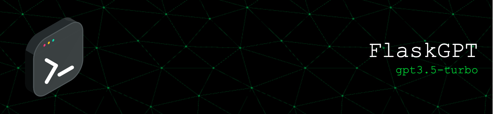

# flaskGPT 🤖

    

### This is a simple implementation of gpt3.5-turbo model from OpenAI with a nice UI made it with Flask.
## Steps 

Usage :nut_and_bolt:

1. Fork this repo (Don't forget to put your OpenAI Keys envs)

2. Deploy to Heroku 

3. Let's test.🧑🏽‍💻

    

